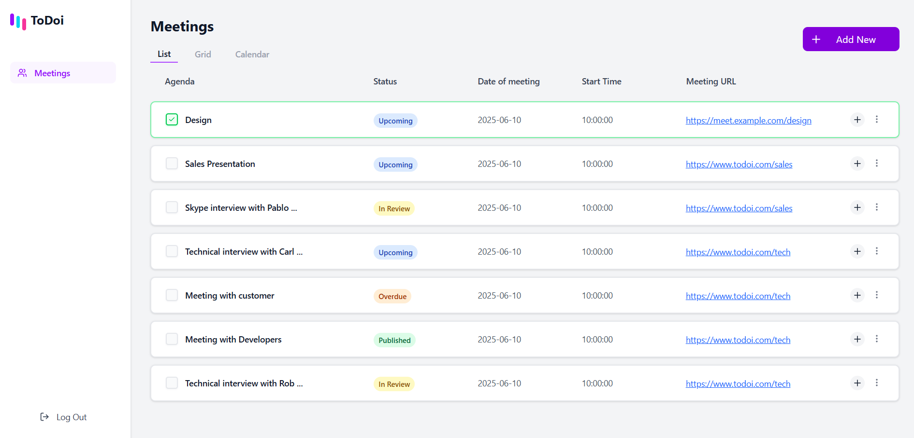
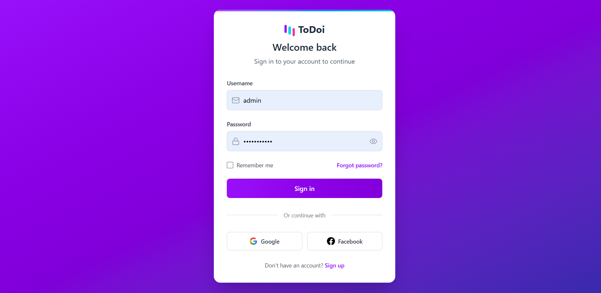

<h1 align="center">Meetings Dashboard</h1>

<p align="center">
A sleek and modern web app to manage, track, and schedule all your meetings in one place.
</p>

## 🖥️ Tech Stack

**Frontend:**

&nbsp;
&nbsp;

**Backend:**

&nbsp;
&nbsp;
&nbsp;


**Deployed On:**


## 📌 Key Features:

<dl> <dt>🧾 Agenda-Based View</dt> <dd>Quickly view your scheduled meetings categorized by agenda with checkbox status indicators.</dd> <dt>📅 Status Tags</dt> <dd>Visually distinct labels like <code>Upcoming</code>, <code>In Review</code>, <code>Overdue</code>, and <code>Published</code> for clear meeting tracking.</dd> <dt>🔗 Meeting Links</dt> <dd>Each meeting includes a direct, clickable URL to its virtual location.</dd> <dt>📆 Calendar & Grid Views</dt> <dd>Switch seamlessly between List, Grid, and Calendar views to suit your preference.</dd> <dt>➕ Add / Edit Meetings</dt> <dd>Use the <strong>Add New</strong> button to quickly schedule or modify meetings with ease.</dd> <dt>🎨 Modern UI</dt> <dd>Clean, responsive interface inspired by tools like Notion and Linear.</dd> </dl>

## 📌 Screenshots:

> **Home Page**  
> 
> 

## 🚀 Getting Started:

Before you begin, ensure you have the following installed on your local machine:

- [Node.js](https://nodejs.org/) (v14 or later)
- [npm](https://www.npmjs.com/) (v6 or later) or [Yarn](https://yarnpkg.com/) (v1 or later)

## 🏠 Running the Project Locally:

Follow these steps to run the Next.js project on your local machine:

1. **Clone the Repository:**

   ```sh
   git clone https://github.com/Zivanika/Ume-App-Assignment.git
   cd Ume-App-Assignment
   ```

2. **Install Dependencies:**

   Using npm:

   ```sh
   npm install
   ```

   Or using Yarn:

   ```sh
   yarn install
   ```

3. **Run the Development Server:**

   Using npm:

   ```sh
   npm run dev
   ```

   Or using Yarn:

   ```sh
   yarn dev
   ```

4. **Open Your Browser:**

   Open your browser and navigate to [http://localhost:5173](http://localhost:5173). You should see the Next.js application running!

## 📜 License:

This project is licensed under the MIT License.

<h2>📬 Contact</h2>

If you want to contact me, you can reach me through below handles.

[](https://www.linkedin.com/in/harshita-barnwal-17a732234/)

© 2025 Harshita Barnwal

[](https://forthebadge.com)
